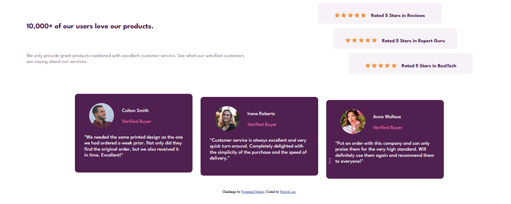

# Frontend Mentor - Social proof section solution

This is a solution to the [Social proof section challenge on Frontend Mentor](https://www.frontendmentor.io/challenges/social-proof-section-6e0qTv_bA). Frontend Mentor challenges help you improve your coding skills by building realistic projects. 

## Table of contents

- [Overview](#overview)
  - [The challenge](#the-challenge)
  - [Screenshot](#screenshot)
  - [Links](#links)
- [My process](#my-process)
  - [Built with](#built-with)
  - [What I learned](#what-i-learned)
  - [Continued development](#continued-development)
  - [Useful resources](#useful-resources)
- [Author](#author)
- [Acknowledgments](#acknowledgments)

**Note: Delete this note and update the table of contents based on what sections you keep.**

## Overview

### The challenge

Users should be able to:

- View the optimal layout for the section depending on their device's screen size

### Screenshot

Desktop View



### Links

- Solution URL: [Frontend Mentor Solution](https://www.frontendmentor.io/solutions/social-proof-section-html-css-LjCZe6ihqF)
- Live Site URL: [Github Pages](https://patricklee22.github.io/social-proof-section/)

## My process

### Built with

- Semantic HTML5 markup
- CSS Grid
- Changing CSS Styling based on screen's min-width


### What I learned

I used this challenge as an opportunity to reinforce my learning with Semantic HTML and CSS Grid to center elements. In addition, this challenge allowed me to learn applying different styles based on the user's screen width. As a small example:


```css
/*Mobile Style*/
.card{
  width: 60%;
}

/*Desktop Style*/
@media screen and (min-width: 720px){ 
  .card{
    width: 30%;
  }
}
```


## Author

- Frontend Mentor - [@yourusername](https://www.frontendmentor.io/profile/patricklee22)
- Github - [PatrickLee22](https://github.com/PatrickLee22)